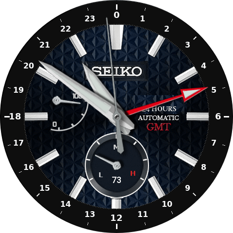

# Amazfit T-Rex 3 Watch Faces

A collection of custom watch faces for the **Amazfit T-Rex 3** (ZeppOS), inspired by classic mechanical watches.

## Watch Faces

### Grand Seiko GMT (`GS-gmt`)
Inspired by the Grand Seiko GMT line. Analog face with a 24-hour GMT hand,
smooth second hand (28,800 bph beat animation), and world clock display with
tap-to-cycle city selection.

### Seiko Presage GMT (`presage`)
Inspired by the Seiko Presage SPB221J1. Analog face with a GMT complication, heart rate display with color-coded alert, and AOD support.

### Seiko 24H (`seiko-24`)
A fictional Seiko 24-hour face. The hour hand completes one full revolution
per 24 hours (midnight at top, noon at bottom), with a 24-hour graduated outer
bezel and GMT complication.

## Usage

### Switching GMT / World Clock Zone
On watch faces with a GMT complication (**GS-gmt**, **presage**, **seiko-24**), tap the GMT letters on the dial to cycle through the world clock cities configured in the Zepp app. A toast notification shows the selected city and its index. The selection persists across restarts.

## Platform

All faces target the **Amazfit T-Rex 3** (480×480, ZeppOS 3.x, device source `8716544`).

## Development

Built with vibecoding
